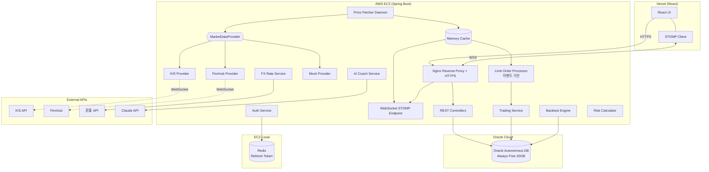

# 📋 PRD: FinTech Portfolio Tracker & Trading Sandbox

| 항목 | 내용 |
|---|---|
| **문서 버전** | v2.1 (D49 운영 가동 반영) |
| **작성일** | 2026-05-20 (v2.0) / 2026-05-26 (v2.1 갱신) |
| **프로젝트 코드명** | `fintech-simulator` |
| **개발 기간** | 10주 (Phase 1~7, D01~D50) |
| **상태** | **운영 가동 중** — [App](https://mockvibe-hazel.vercel.app) · [API](https://mockvibe.duckdns.org/actuator/health) · [Postmortem](docs/operations/d49-deployment-postmortem.md) |

> **v2.1 변경**: D49 운영 배포 완료. 본 PRD의 In-Scope 전 항목이 외부 도메인에서 동작 중. 11건의 운영 이슈와 해결은 별도 [postmortem 문서](docs/operations/d49-deployment-postmortem.md). 아키텍처 결정 9건은 [docs/decisions/](docs/decisions/).

---

## 1. 개요 (Overview)

### 1.1 한 줄 정의
**한국·미국 주식을 통합 거래할 수 있는 실시간 모의투자 + AI 코치 + 백테스트 + 리스크 분석 풀스택 플랫폼**

### 1.2 핵심 가치 제안
1. **이중 시장 통합**: KRX(한국투자증권 API) + NYSE/NASDAQ(Finnhub)을 단일 UI에서
2. **실시간성**: 외부 WebSocket → 백엔드 캐시 → STOMP 릴레이로 다중 클라이언트에 동시 공급
3. **엔터프라이즈 트랜잭션**: 비관적+낙관적 락 하이브리드, 단일 트랜잭션 정합성
4. **차별화 3종 세트**: AI 매매 코치, 백테스트 엔진, 리스크 대시보드
5. **운영 안정성**: Circuit Breaker + Mock Fallback으로 외부 API 장애에도 데모 가능

### 1.3 본 PRD의 목표
포트폴리오용 풀스택 프로젝트로서, 기술 면접에서 **아키텍처 결정의 의도**를 30분 이상 깊이 있게 설명 가능한 수준의 시스템을 구축한다.

---

## 2. 배경 (Background)

### 2.1 프로젝트 동기
- 단순 CRUD를 넘는 **실시간성 + 동시성 + 외부 API 통합** 도메인
- KIS API 이미 보유 → 실제 증권사 API 연동 경험
- 미국 주식 통합으로 **Provider 추상화 아키텍처**까지 어필

### 2.2 차별점
- **양 시장 통합 포트폴리오 뷰** (KRW/USD 환산, 환율 변동 반영)
- **AI 매매 코치** (포트폴리오 컨텍스트 기반 조언/회고)
- **백테스트 엔진** (과거 데이터로 매매 전략 검증)
- **리스크 대시보드** (VaR, Sharpe, Beta, 집중도)
- **이벤트 기반 지정가 체결** (폴링 없는 효율적 아키텍처)

---

## 3. 사용자 (Target Users)

### 3.1 주요 페르소나
**20~30대 투자 입문/중급자**
- 한국·미국 주식 둘 다 관심
- 실제 매매 전에 전략 테스트 원함
- 모바일/웹 모두 사용

### 3.2 핵심 시나리오
1. **자산 모니터링**: 출근길에 보유 종목 손익 통합 조회
2. **즉시 매매**: 장 중 시장가 모의 매수
3. **예약 매매**: 미국장 마감 후 지정가 등록
4. **백테스트**: 주말에 "이동평균 전략 1년치" 시뮬레이션
5. **AI 회고**: 주간 매매 패턴 분석 리포트 수령
6. **리스크 점검**: 포트폴리오 집중도/변동성 지표 확인

---

## 4. 범위 (Scope)

### 4.1 In-Scope (반드시 포함)
- ✅ 회원가입/로그인 (JWT + Refresh Token Rotation + Redis 블랙리스트)
- ✅ KIS API (한국 주식, 모의투자)
- ✅ Finnhub API (미국 주식, 무료 티어)
- ✅ Mock Price Engine (Circuit Breaker Fallback)
- ✅ 시장가 매수/매도
- ✅ 지정가 예약 주문 + 이벤트 기반 자동 체결
- ✅ 포트폴리오 대시보드
- ✅ 거래 내역 / 예약 주문 관리
- ✅ WebSocket (STOMP) 시세 릴레이
- ✅ 환율 자동 환산 (KRW/USD)
- ✅ **AI 매매 코치** (Claude API)
- ✅ **백테스트 엔진**
- ✅ **리스크 대시보드** (VaR, Sharpe, Beta, 집중도)
- ✅ **관리자 페이지** (사용자/종목/거래/시스템 운영)
- ✅ 라이트/다크 모드
- ✅ AWS EC2 + Vercel 배포

### 4.2 Out-of-Scope
- ❌ 실제 거래 (모의투자 전용)
- ❌ 옵션/선물/암호화폐
- ❌ 모바일 네이티브 앱 (반응형 웹)
- ❌ 부분 체결 (전량 체결 가정)
- ❌ 다중 통화 계좌 (KRW 단일 지갑, USD는 환율 환산)

---

## 5. 기능 요구사항 (Functional Requirements)

### FR-1. 인증 & 계정
| ID | 요구사항 | 우선순위 |
|---|---|---|
| FR-1.1 | 이메일/비밀번호 회원가입 (BCrypt cost 12) | P0 |
| FR-1.2 | JWT Access Token (15분) + Refresh Token (7일) | P0 |
| FR-1.3 | Refresh Token Rotation + Redis 블랙리스트 | P0 |
| FR-1.4 | 회원가입 시 시드머니 1,000만원 지급 | P0 |
| FR-1.5 | 계정 초기화 (시드머니 리셋) | P1 |
| FR-1.6 | RBAC: 사용자 권한 `USER` / `ADMIN` 분리 (JWT claim) | P0 |
| FR-1.7 | 관리자 전용 API 게이트 (`@PreAuthorize("hasRole('ADMIN')")`) | P0 |

### FR-2. 시장 데이터
| ID | 요구사항 | 우선순위 |
|---|---|---|
| FR-2.1 | KIS WebSocket 실시간 시세 수신 | P0 |
| FR-2.2 | Finnhub WebSocket 실시간 시세 수신 | P0 |
| FR-2.3 | `MarketDataProvider` 인터페이스 추상화 | P0 |
| FR-2.4 | ConcurrentHashMap 메모리 캐시 | P0 |
| FR-2.5 | Mock Price Engine Fallback (Circuit Breaker) | P0 |
| FR-2.6 | 일/주/월 차트용 과거 시세 (REST + DB 캐시) | P0 |
| FR-2.7 | KIS 호가창 데이터 | P1 |
| FR-2.8 | 동적 구독 관리 (사용자 관심 종목만) | P1 |
| FR-2.9 | 종목 마스터 DB 적재 (한국 30 + 미국 30) | P0 |

### FR-3. 매매
| ID | 요구사항 | 우선순위 |
|---|---|---|
| FR-3.1 | 시장가 매수 (현재가 즉시 체결) | P0 |
| FR-3.2 | 시장가 매도 | P0 |
| FR-3.3 | 지정가 매수/매도 등록 | P0 |
| FR-3.4 | 지정가 주문 취소 | P0 |
| FR-3.5 | 미국 주식 매매 시 환율 자동 환산 | P0 |
| FR-3.6 | 거래 수수료 차감 (KRX 0.015%, 미국 0.25%) | P1 |
| FR-3.7 | 장 운영 시간 검증 (서머타임 포함) | P1 |
| FR-3.8 | 지정가 유효기한 (기본 30일) | P1 |

### FR-4. 포트폴리오
| ID | 요구사항 | 우선순위 |
|---|---|---|
| FR-4.1 | 보유 종목 + 평균단가/평가손익 | P0 |
| FR-4.2 | 자산 비중 도넛 차트 (ApexCharts) | P0 |
| FR-4.3 | 일자별 자산 추이 라인 차트 | P0 |
| FR-4.4 | 한국/미국 시장별 분리 뷰 | P1 |
| FR-4.5 | 거래 내역 페이지네이션 + 필터 | P0 |
| FR-4.6 | 관심 종목 (Watchlist) | P1 |

### FR-5. 실시간 시세 (WebSocket)
| ID | 요구사항 | 우선순위 |
|---|---|---|
| FR-5.1 | STOMP 토픽 구독 (`/topic/price/{ticker}`) | P0 |
| FR-5.2 | 사용자별 선택적 구독 | P1 |
| FR-5.3 | 자동 재연결 (Exponential Backoff) | P0 |
| FR-5.4 | 가격 변경 시 깜빡임 애니메이션 | P1 |
| FR-5.5 | Heartbeat (15초) | P1 |

### FR-6. 환율
| ID | 요구사항 | 우선순위 |
|---|---|---|
| FR-6.1 | 환율 API 연동 (ExchangeRate-API 또는 ECOS) | P0 |
| FR-6.2 | 환율 1분마다 캐시 갱신 | P0 |
| FR-6.3 | 매매 시점 환율을 ORDERS에 기록 | P0 |

### FR-7. AI 매매 코치 ⭐ (차별화)
| ID | 요구사항 | 우선순위 |
|---|---|---|
| FR-7.1 | 매매 직후 한 줄 코멘트 (사용자당 일 10회 제한) | P0 |
| FR-7.2 | 주간 회고 리포트 자동 생성 (매주 일요일) | P0 |
| FR-7.3 | "지금 내 포트폴리오 분석해줘" 즉시 분석 | P1 |
| FR-7.4 | Claude 프롬프트 캐싱 활용 | P0 |
| FR-7.5 | 응답 캐싱 (동일 포트폴리오 해시 → 재사용) | P1 |
| FR-7.6 | 감정적 매매 패턴 감지 (3일 연속 손절 등) | P1 |

### FR-8. 백테스트 엔진 ⭐ (차별화)
| ID | 요구사항 | 우선순위 |
|---|---|---|
| FR-8.1 | 사전 정의 전략: 단순매수보유, 이동평균(MA20), RSI(14) | P0 |
| FR-8.2 | 사용자 DSL 전략 정의 (간단한 JSON 룰) | P1 |
| FR-8.3 | 과거 시세 1~3년치 DB 적재 (PRICE_HISTORY) | P0 |
| FR-8.4 | 결과 지표: 누적 수익률, MDD, 샤프지수, 거래횟수, 승률 | P0 |
| FR-8.5 | 결과 시각화: 자산 곡선, 매매 신호 차트 | P0 |
| FR-8.6 | 백테스트 결과 영구 저장 + 비교 | P1 |

### FR-9. 리스크 대시보드 ⭐ (차별화)
| ID | 요구사항 | 우선순위 |
|---|---|---|
| FR-9.1 | VaR (Value at Risk, 95% / 99% / 1일) | P0 |
| FR-9.2 | Sharpe Ratio (1년 기준) | P0 |
| FR-9.3 | Beta (대비 지수: KOSPI / S&P500) | P0 |
| FR-9.4 | Max Drawdown | P0 |
| FR-9.5 | 섹터/지역 집중도 게이지 + 경고 | P0 |
| FR-9.6 | 종목 간 상관관계 히트맵 | P1 |
| FR-9.7 | 일일 리스크 지표 배치 계산 | P0 |

### FR-10. 관리자 페이지 ⭐ (운영)
| ID | 요구사항 | 우선순위 |
|---|---|---|
| **사용자 관리** | | |
| FR-10.1 | 사용자 목록 조회 (페이지네이션, 검색: 이메일/이름) | P0 |
| FR-10.2 | 사용자 상세 (자산, 거래 통계, 최근 로그인) | P0 |
| FR-10.3 | 사용자 계정 정지/해제 (정지 시 JWT 즉시 무효화) | P0 |
| FR-10.4 | 시드머니 강제 조정 (증액/감액, 사유 필수) | P0 |
| FR-10.5 | 계정 강제 초기화 (보유 종목·예약·이력 일괄 리셋) | P1 |
| FR-10.6 | 사용자 권한 변경 (USER ↔ ADMIN) | P1 |
| **종목 관리** | | |
| FR-10.7 | STOCKS 마스터 추가/수정/비활성화 | P0 |
| FR-10.8 | 종목 활성화 토글 (비활성 종목은 매매 차단) | P0 |
| FR-10.9 | PRICE_HISTORY 수동 재적재 (백테스트용 데이터 보정) | P1 |
| **거래 모니터링** | | |
| FR-10.10 | 전체 거래 내역 조회 (사용자/종목/기간 필터) | P0 |
| FR-10.11 | 이상 거래 탐지 알림 (단시간 다수 매매, 큰 금액 등) | P1 |
| FR-10.12 | 예약 주문 강제 취소 (특정 종목 상장폐지 대응) | P1 |
| **시스템 운영** | | |
| FR-10.13 | 외부 API 상태 대시보드 (KIS/Finnhub/FX/Claude 헬스체크) | P0 |
| FR-10.14 | Circuit Breaker 상태 확인 + 수동 Reset | P0 |
| FR-10.15 | 캐시 히트율 / WebSocket 연결 수 / DB 커넥션풀 | P0 |
| FR-10.16 | 시세 Provider 강제 전환 (실시간 ↔ Mock) | P0 |
| FR-10.17 | 배치 작업 수동 트리거 (리스크 지표, 주간 리포트) | P1 |
| **AI 비용 관리** | | |
| FR-10.18 | Claude API 토큰 사용량/예상 비용 일/월별 집계 | P0 |
| FR-10.19 | 사용자별 AI 호출 횟수 + 일일 한도 조정 | P1 |
| **공지 & 감사** | | |
| FR-10.20 | 공지사항 등록/수정/삭제 (메인 배너 노출) | P1 |
| FR-10.21 | 관리자 액션 감사 로그 (모든 변경 기록, 불변) | P0 |
| FR-10.22 | 위험 작업 2단계 확인 (비밀번호 재입력) | P0 |

---

## 6. 비기능 요구사항 (Non-Functional Requirements)

### NFR-1. 성능
- 시세 전파 지연: **외부 수신 후 100ms 이내** 전체 구독자에게 전달
- 매매 API 응답: **p95 < 300ms**
- 백테스트 1년치 1종목: **3초 이내**
- 동시 접속자 50명 환경에서 정상 동작

### NFR-2. 동시성 & 정합성
- 동일 사용자 동시 매매 → 잔고 음수 절대 불가
- **Wallet: 비관적 락 (`@Lock(PESSIMISTIC_WRITE)`)**
- **Holdings: 낙관적 락 (`@Version`)**
- 트랜잭션 락 순서: Wallet → Holdings → Orders (데드락 방지)

### NFR-3. 외부 API 보호
- KIS WebSocket: 동시 구독 41개 한도 준수
- Finnhub: 60 calls/min 준수 (Token Bucket)
- Claude: 사용자당 일 10회 제한 + 프롬프트 캐싱
- Circuit Breaker (Resilience4j): 5회 연속 실패 → Mock 전환, 30초 후 Half-Open 재시도

### NFR-4. 보안
- 비밀번호 BCrypt (cost 12)
- JWT 만료: Access 15분 / Refresh 7일 + Rotation
- HTTPS 강제 (Let's Encrypt)
- API Key 환경변수 분리 (절대 코드 미포함)
- CORS 화이트리스트 (Vercel 도메인만)
- SQL Injection 방지 (JPA 파라미터 바인딩)
- **RBAC**: Spring Security `@PreAuthorize` 기반, JWT claim `role` 검증
- **관리자 액션 감사 로그**: 불변(INSERT only), 액션·대상·이전값·이후값·IP·UA 기록
- **위험 작업 보호**: 시드머니 조정·권한 변경·강제 초기화는 비밀번호 재인증 필수
- **Brute Force 방어**: 관리자 로그인 5회 실패 시 IP 15분 차단

### NFR-5. 관측성
- Spring Boot Actuator + Micrometer
- 핵심 메트릭:
  - WebSocket 연결 수
  - 외부 API 호출 횟수 (provider별)
  - 캐시 히트율
  - 지정가 체결 지연 (등록→체결)
  - Claude API 비용 (토큰 사용량)
- 로그: SLF4J + Logback, MDC로 요청 ID 추적

### NFR-6. 운영
- Docker Compose 한 줄로 로컬 전체 스택 기동
- 환경 분리: `application-{local,dev,prod}.yml`
- DB 마이그레이션: Flyway

---

## 7. 시스템 아키텍처 (System Architecture)

### 7.1 컴포넌트 다이어그램



### 7.2 핵심 설계 결정 (ADR 요약)

| # | 결정 | 선택 | 이유 |
|---|---|---|---|
| 1 | 시세 공급 | 백엔드 단일 WebSocket → 캐시 → STOMP 브로드캐스트 | 외부 Rate Limit 보호, N-to-N 방지 |
| 2 | 락 전략 | Wallet 비관적 + Holdings 낙관적 하이브리드 | 충돌 빈도별 최적화 |
| 3 | 지정가 체결 | 이벤트 기반 (시세 갱신 이벤트) | 폴링 제거, Oracle 인덱스 활용 |
| 4 | Provider 분리 | 인터페이스 + 3구현체 (KIS/Finnhub/Mock) | OCP, 확장성 |
| 5 | Fallback | Circuit Breaker → Mock | 데모 안정성 |
| 6 | 종목 유니버스 | 한국 30 + 미국 30 고정 | API 한도 + 검색 즉시성 |
| 7 | DB | Oracle (로컬 XE / 배포 Autonomous) | JPA dialect로 양립 |
| 8 | 인증 | JWT + Refresh Rotation + Redis 블랙리스트 | 보안 깊이 |
| 9 | 백테스트 | DB 일괄 적재 후 In-Memory 시뮬레이션 | API 호출 0회 |
| 10 | AI 호출 | 트리거 제한 + 프롬프트 캐싱 + 응답 캐싱 | 비용 통제 |
| 11 | 권한 분리 | JWT claim `role` + `@PreAuthorize` RBAC | 단일 토큰으로 USER/ADMIN 구분, 게이트 일원화 |
| 12 | 감사 로그 | AOP `@Auditable` + INSERT-only 테이블 | 코드 침투 최소화, 변조 방지 |
| 13 | 위험 작업 | 비밀번호 재인증 + 단기 step-up 토큰 | 탈취된 세션의 자금 조작 차단 |

### 7.3 패키지 구조 (Backend)

```
com.fintech.simulator
├── config/
│   ├── WebSocketConfig
│   ├── SecurityConfig
│   ├── RedisConfig
│   ├── SchedulerConfig
│   └── ResilienceConfig          # Circuit Breaker
├── auth/
│   ├── controller, service, repository, dto, jwt
├── market/
│   ├── provider/
│   │   ├── MarketDataProvider (interface)
│   │   ├── KisMarketDataProvider
│   │   ├── FinnhubMarketDataProvider
│   │   └── MockMarketDataProvider
│   ├── cache/PriceCache
│   ├── fetcher/PriceFetcherDaemon
│   ├── websocket/PriceBroadcaster
│   └── event/PriceUpdatedEvent
├── trading/
│   ├── controller, service, repository
│   ├── domain/ (Order, LimitOrder)
│   └── scheduler/LimitOrderProcessor   # 이벤트 리스너
├── portfolio/
│   ├── controller, service
│   └── domain/ (Holding, Wallet)
├── fx/
├── ai/                          # AI 코치
│   ├── service/AiCoachService
│   ├── prompt/PromptBuilder
│   └── cache/ResponseCache
├── backtest/                    # 백테스트
│   ├── controller, service
│   ├── strategy/ (BuyHold, MovingAverage, Rsi)
│   ├── engine/BacktestEngine
│   └── dto/
├── risk/                        # 리스크
│   ├── controller, service
│   └── calculator/ (Var, Sharpe, Beta, Mdd)
├── admin/                       # 관리자
│   ├── controller/ (UserAdminController, StockAdminController,
│   │                TradeAdminController, SystemAdminController,
│   │                AnnouncementController)
│   ├── service/ (AdminUserService, AdminStockService,
│   │             AdminSystemService, AuditLogService)
│   ├── audit/ (AuditAspect, AuditLogger)        # AOP 기반 자동 감사
│   ├── security/ (AdminAuthFilter, ReAuthenticationFilter)
│   └── dto/
└── common/
    ├── exception/
    └── util/
```

---

## 8. 데이터 모델 (Data Model)

### 8.1 ERD

```mermaid
erDiagram
    USERS ||--|| WALLET : has
    USERS ||--o{ ORDERS : places
    USERS ||--o{ HOLDINGS : owns
    USERS ||--o{ LIMIT_ORDERS : registers
    USERS ||--o{ WATCHLIST : watches
    USERS ||--o{ BACKTEST_RUNS : runs
    USERS ||--o{ AI_REPORTS : receives
    STOCKS ||--o{ HOLDINGS : referenced
    STOCKS ||--o{ ORDERS : referenced
    STOCKS ||--o{ LIMIT_ORDERS : referenced
    STOCKS ||--o{ WATCHLIST : referenced
    STOCKS ||--o{ PRICE_HISTORY : has

    USERS {
        VARCHAR2(50) user_id PK
        VARCHAR2(100) password
        VARCHAR2(50) username
        VARCHAR2(100) email
        VARCHAR2(10) role "USER | ADMIN"
        VARCHAR2(10) status "ACTIVE | SUSPENDED"
        TIMESTAMP last_login_at
        TIMESTAMP created_at
    }
    WALLET {
        NUMBER wallet_id PK
        VARCHAR2(50) user_id FK
        NUMBER cash_balance "예수금 KRW"
        TIMESTAMP updated_at
    }
    STOCKS {
        VARCHAR2(20) ticker PK
        VARCHAR2(10) market "KRX | NASDAQ | NYSE"
        VARCHAR2(10) currency "KRW | USD"
        VARCHAR2(100) company_name
        VARCHAR2(50) sector
        NUMBER current_price
        NUMBER tick_size
        TIMESTAMP updated_at
    }
    HOLDINGS {
        NUMBER holding_id PK
        VARCHAR2(50) user_id FK
        VARCHAR2(20) ticker FK
        NUMBER quantity
        NUMBER average_price_krw
        NUMBER version "낙관적 락"
        TIMESTAMP updated_at
    }
    ORDERS {
        NUMBER order_id PK
        VARCHAR2(50) user_id FK
        VARCHAR2(20) ticker FK
        VARCHAR2(10) order_type "BUY | SELL"
        VARCHAR2(10) order_method "MARKET | LIMIT"
        NUMBER price
        NUMBER quantity
        NUMBER fx_rate
        NUMBER fee
        TIMESTAMP created_at
    }
    LIMIT_ORDERS {
        NUMBER limit_order_id PK
        VARCHAR2(50) user_id FK
        VARCHAR2(20) ticker FK
        VARCHAR2(10) order_type
        NUMBER target_price
        NUMBER quantity
        VARCHAR2(20) status "PENDING | FILLED | CANCELLED | EXPIRED"
        TIMESTAMP expires_at
        TIMESTAMP created_at
    }
    WATCHLIST {
        NUMBER watchlist_id PK
        VARCHAR2(50) user_id FK
        VARCHAR2(20) ticker FK
        TIMESTAMP added_at
    }
    PRICE_HISTORY {
        NUMBER history_id PK
        VARCHAR2(20) ticker FK
        DATE trade_date
        NUMBER open_price
        NUMBER high_price
        NUMBER low_price
        NUMBER close_price
        NUMBER volume
    }
    FX_RATES {
        NUMBER fx_id PK
        VARCHAR2(10) base_currency
        VARCHAR2(10) quote_currency
        NUMBER rate
        TIMESTAMP fetched_at
    }
    BACKTEST_RUNS {
        NUMBER run_id PK
        VARCHAR2(50) user_id FK
        VARCHAR2(50) strategy_name
        CLOB strategy_params "JSON"
        VARCHAR2(20) ticker
        DATE start_date
        DATE end_date
        NUMBER initial_capital
        NUMBER final_value
        NUMBER total_return
        NUMBER mdd
        NUMBER sharpe
        NUMBER trade_count
        NUMBER win_rate
        CLOB result_detail "JSON: 자산 곡선, 매매 시점"
        TIMESTAMP created_at
    }
    AI_REPORTS {
        NUMBER report_id PK
        VARCHAR2(50) user_id FK
        VARCHAR2(20) report_type "TRADE_COMMENT | WEEKLY | INSTANT"
        CLOB context_hash "캐시 키"
        CLOB content
        NUMBER token_used
        TIMESTAMP created_at
    }
    ADMIN_AUDIT_LOGS {
        NUMBER audit_id PK
        VARCHAR2(50) admin_user_id FK
        VARCHAR2(50) action "SUSPEND_USER | ADJUST_CASH | TOGGLE_STOCK | RESET_CB | ..."
        VARCHAR2(50) target_type "USER | STOCK | ORDER | SYSTEM"
        VARCHAR2(100) target_id
        CLOB before_value "JSON"
        CLOB after_value "JSON"
        VARCHAR2(500) reason
        VARCHAR2(45) ip_address
        VARCHAR2(500) user_agent
        TIMESTAMP created_at
    }
    ANNOUNCEMENTS {
        NUMBER announcement_id PK
        VARCHAR2(50) admin_user_id FK
        VARCHAR2(200) title
        CLOB content
        VARCHAR2(20) level "INFO | WARNING | CRITICAL"
        NUMBER is_active
        TIMESTAMP starts_at
        TIMESTAMP ends_at
        TIMESTAMP created_at
    }
```



### 8.2 인덱스 전략
| 테이블 | 인덱스 | 목적 |
|---|---|---|
| `LIMIT_ORDERS` | `(ticker, status, target_price)` | 이벤트 기반 체결 후보 조회 |
| `ORDERS` | `(user_id, created_at DESC)` | 거래 내역 |
| `HOLDINGS` | `(user_id, ticker)` UNIQUE | 보유 종목 |
| `PRICE_HISTORY` | `(ticker, trade_date)` UNIQUE | 백테스트 시계열 조회 |
| `FX_RATES` | `(base_currency, quote_currency, fetched_at DESC)` | 최신 환율 |
| `AI_REPORTS` | `(user_id, report_type, created_at DESC)` | 리포트 조회 |
| `ADMIN_AUDIT_LOGS` | `(admin_user_id, created_at DESC)`, `(target_type, target_id)` | 감사 로그 조회 |
| `ANNOUNCEMENTS` | `(is_active, starts_at, ends_at)` | 활성 공지 조회 |
| `USERS` | `(role)`, `(status)` | 관리자 사용자 필터링 |

---

## 9. 외부 연동 (External Integrations)

### 9.1 KIS (한국투자증권)
- **인증**: OAuth 2.0, AppKey + AppSecret → Access Token (24h)
- **시세**: 실시간은 WebSocket, 차트 과거 데이터는 REST
- **환경**: 모의투자 환경(`mock`) 사용
- **제한**: WebSocket 동시 41종목, REST 초당 ~5건

### 9.2 Finnhub
- **인증**: API Key (헤더)
- **WebSocket**: 무료 티어 실시간 미국 주식
- **REST**: 60 calls/min (차트 과거 데이터용)
- **엔드포인트**: `wss://ws.finnhub.io?token=...`

### 9.3 환율
- **ExchangeRate-API** (1500 calls/month 무료) 우선
- 백업: 한국은행 ECOS

### 9.4 Claude API (AI 코치)
- 모델: `claude-haiku-4-5-20251001` (비용 절감)
- 프롬프트 캐싱: 시스템 프롬프트 + 종목 메타데이터 캐싱
- 트리거 제한: 사용자당 일 10회
- 응답 캐싱: `(user_id, portfolio_hash)` 기준

---

## 10. API 호출 제한 전략 (Rate Limit Handling)

| # | 전략 | 적용 대상 |
|---|---|---|
| 1 | **WebSocket 1순위** (REST 최후) | KIS, Finnhub |
| 2 | **종목 유니버스 60개 제한** | 전체 |
| 3 | **동적 구독 관리** (보는 종목만) | KIS, Finnhub |
| 4 | **다층 캐시** (Memory + DB) | 시세, 차트, 환율 |
| 5 | **Token Bucket** (Bucket4j) | REST 호출 |
| 6 | **Circuit Breaker** (Resilience4j) | 전체 외부 API |
| 7 | **Mock Fallback** | 외부 API 장애/한도 초과 시 |
| 8 | **프롬프트 + 응답 캐싱** | Claude API |
| 9 | **백테스트 DB 일괄 적재** | 외부 호출 0회 |

---

## 11. UX/UI 요구사항

### 11.1 디자인 시스템
- **톤**: Toss + Robinhood 미니멀
- **색상**: **한국식 (상승=빨강 #E74C3C, 하락=파랑 #3498DB)**
- **폰트**: Pretendard + Inter
- **모드**: 라이트/다크 토글
- **상태 관리**: Zustand (가볍고 보일러플레이트 적음)

### 11.2 차트 라이브러리
- **TradingView Lightweight Charts**: 종목 상세 캔들/라인
- **ApexCharts**: 대시보드 도넛, 자산 추이, 리스크 게이지
- **백테스트 자산 곡선**: TradingView Lightweight (라인 + 매수/매도 마커)

### 11.3 주요 화면
| 화면 | 핵심 컴포넌트 |
|---|---|
| 로그인/회원가입 | 이메일 인증, 비밀번호 강도 |
| 대시보드 | 총자산, 자산 비중 도넛, 일별 추이, 보유 카드, **AI 위클리 리포트 카드** |
| 종목 검색 | 한/미 통합, 시장 필터 |
| 종목 상세 | 캔들 차트, 호가창(KRX), 매매 패널, 실시간 시세 |
| 매매 패널 | 시장가/지정가 탭, Toss 키패드, 슬라이더 |
| 거래 내역 | 필터/페이지네이션, **AI 코멘트 인라인** |
| 예약 주문 | 대기 목록, 취소 |
| **백테스트** | 전략 선택, 종목/기간 선택, 자산 곡선, 결과 지표 카드 |
| **리스크 대시보드** | VaR/Sharpe/Beta 카드, 집중도 게이지, 상관관계 히트맵 |
| **AI 코치 리포트** | 주간 리포트 목록, 상세 뷰 |
| **관리자 로그인** | 일반 로그인 후 추가 2FA 또는 비밀번호 재입력 |
| **관리자 - 사용자** | 검색/필터 테이블, 상세 패널, 정지/시드머니/권한 액션 |
| **관리자 - 종목** | STOCKS 마스터 CRUD, 활성 토글, 시세 재적재 트리거 |
| **관리자 - 거래** | 전체 거래 필터/정렬, 이상 거래 하이라이트, 강제 취소 |
| **관리자 - 시스템** | 외부 API 헬스 상태등, Circuit Breaker, 캐시 메트릭, Provider 토글 |
| **관리자 - AI 비용** | 일/월 토큰 사용량 차트, 사용자별 호출 Top N |
| **관리자 - 공지** | 공지 CRUD, 활성 기간 설정, 미리보기 |
| **관리자 - 감사 로그** | 액션/대상/관리자/기간 필터, 변경 전·후 diff 뷰 |

### 11.4 반응형
- Desktop (1280+) / Tablet (768+) / Mobile (375+)

---

## 12. 마일스톤 (10주 계획)

| Phase | 주차 | 산출물 |
|---|---|---|
| **P1. MVP 기반** | 1~2주 | 인증(JWT+Refresh+Redis, **RBAC role 클레임**), DB 스키마(**USERS.role/status**), Provider 인터페이스, Mock Engine, 시장가 매매, 포트폴리오 화면 골격 |
| **P2. 실시간 시세** | 3주 | KIS WebSocket, Finnhub WebSocket, STOMP 릴레이, 환율, 가격 깜빡임 |
| **P3. 지정가 + 정합성** | 4주 | 지정가 등록/취소, 이벤트 기반 체결, 락 전략 구현, 동시성 테스트, Circuit Breaker |
| **P4. 리스크 대시보드** | 5주 | VaR/Sharpe/Beta/MDD 계산, 집중도 게이지, 상관관계 히트맵 |
| **P5. 백테스트 엔진** | 6~7주 | PRICE_HISTORY 적재, 전략 3종, 엔진, 결과 시각화, 비교 기능 |
| **P6. AI 코치** | 8~9주 | Claude 연동, 프롬프트 설계, 프롬프트/응답 캐싱, 트리거 제한, 주간 리포트 스케줄러 |
| **P7. 관리자 + 운영 & 배포** | 10주 | **관리자 페이지(RBAC, 사용자/종목/거래/시스템/AI 비용/공지/감사 로그)**, 관측성, 부하 테스트, Docker Compose, **AWS EC2 + Vercel 배포**, Oracle ADB 연결, README + ADR 문서 |

---

## 13. 배포 아키텍처 (Deployment)

### 13.1 인프라 구성

```
[사용자 브라우저]
       ↓ HTTPS
[Vercel] ──── React 정적 빌드 (CDN)
       ↓ HTTPS/WSS (CORS 화이트리스트)
[AWS EC2 t3.micro] ──── Nginx (HTTPS Let's Encrypt) → Spring Boot (Docker)
       │                       └── Redis (Docker, 같은 EC2)
       ↓ mTLS (Oracle Wallet)
[Oracle Cloud Autonomous DB] ──── Always Free 20GB

[External]
  ├─ KIS API (모의투자)
  ├─ Finnhub WebSocket
  ├─ ExchangeRate-API
  └─ Claude API
```

### 13.2 EC2 t3.micro 운영 전략 (1GB RAM 빡빡함 대응)

| 항목 | 설정 |
|---|---|
| JVM 힙 | `-Xms256m -Xmx512m` |
| GC | G1GC (`-XX:+UseG1GC`) |
| Swap | 2GB 추가 설정 |
| 빌드 위치 | **로컬에서 JAR 빌드 → SCP 업로드** (EC2 빌드 금지, OOM 위험) |
| Docker | Redis만 컨테이너, Spring Boot는 systemd로 직접 (오버헤드 절감) |
| Nginx | HTTPS 종단 + WebSocket 프록시 |
| 모니터링 | CloudWatch 무료 메트릭 + Actuator |

### 13.3 Oracle Cloud Autonomous DB 연결
- **무료 한도**: 20GB × 2개, 1 OCPU
- **Always Free**: 영구 무료
- **연결**: Oracle Wallet (mTLS) 다운로드 → EC2에 배치 → JDBC URL에 wallet 경로 지정
- **장점**: Oracle 문법 그대로 (로컬 XE와 동일 코드)
- **주의**: 7일 비활성 시 정지 → 헬스체크로 활성 유지

### 13.4 환경별 설정
```yaml
# application-local.yml  → Oracle XE (Docker)
# application-prod.yml   → Oracle ADB (Wallet 인증)
```

JPA Dialect는 동일 (`OracleDialect`).

### 13.5 비용 예상
| 항목 | 12개월 내 | 12개월 후 |
|---|---|---|
| EC2 t3.micro | 무료 | ~$8/월 |
| EBS 30GB | 무료 | ~$3/월 |
| Vercel | 무료 | 무료 |
| Oracle ADB | 무료 | 무료 |
| Redis | EC2 내장 (추가 비용 X) | - |
| Claude API | 사용량 비례 (테스트 시 월 $1~5) | - |
| **합계** | **~$0~5/월** | **~$11~15/월** |

---

## 14. 검증 계획 (Verification Plan)

### 14.1 자동화 테스트
- **동시성 통합 테스트**: `ExecutorService`로 동일 사용자 10개 동시 매수 → 잔고 음수 발생 0건 검증
- **외부 API 캐시 검증**: 100 클라이언트 시세 요청 → 외부 API 호출 횟수 = 1 검증
- **백테스트 결과 검증**: 단순매수보유 전략의 누적 수익률 = (종가/시초가 - 1) 검증
- **리스크 계산 검증**: VaR/Sharpe 값을 수식 직접 계산 결과와 비교
- **RBAC 권한 테스트**: USER 토큰으로 관리자 API 호출 → 403 검증, ADMIN 토큰 → 200 검증
- **감사 로그 자동 기록 테스트**: 시드머니 조정 API 호출 후 ADMIN_AUDIT_LOGS에 before/after 정확히 기록되는지 검증
- **위험 작업 step-up 테스트**: 일반 ADMIN 토큰만으로 시드머니 조정 → 401, 재인증 토큰 → 200 검증

### 14.2 수동 검증
- WebSocket 단절 → 자동 재연결 확인
- 라이트/다크 모드 전환 시 차트 가독성
- Mock Engine 전환 시 가격 흐름 자연스러움
- AI 코치 응답 톤/품질 (사람이 읽기)

### 14.3 부하 테스트
- k6 또는 JMeter로 동시 50명 시뮬레이션
- WebSocket 시세 전파 지연 95p 측정
- 매매 API 응답 시간 95p 측정

---

## 15. 리스크 & 완화 (Risks & Mitigations)

| 리스크 | 영향 | 완화 |
|---|---|---|
| KIS 모의투자 계좌 발급 지연 | 중 | Mock Engine 우선 개발로 병렬 진행 |
| Finnhub WebSocket 무료 한도 | 중 | 60종목 제한 + 캐시 + Mock Fallback |
| EC2 1GB 메모리 OOM | 고 | JVM 튜닝 + Swap + 로컬 빌드 |
| Oracle ADB 7일 비활성 정지 | 중 | 헬스체크 크론 (Actuator → DB ping) |
| Claude API 비용 폭증 | 중 | 트리거 제한 + 캐싱 + 토큰 모니터링 |
| 10주 일정 초과 | 고 | P4~P6 중 하나 단순화 (AI 코치 → 주간 리포트만) |
| 차별화 기능 깊이 부족 | 중 | 각 기능 README에 "왜/어떻게" ADR 작성 |

---

## 16. 성공 지표 (Success Metrics)

### 기술적
- ✅ 동시성 테스트 코드로 락 전략 입증
- ✅ Docker Compose 한 줄로 로컬 기동
- ✅ AWS 배포 + 데모 URL 상시 접속 가능
- ✅ Mock 모드로 오프라인 시연 가능

### 문서화
- ✅ README에 핵심 아키텍처 결정 10개 ADR
- ✅ 데모 영상 3분 이내
- ✅ 기술 면접에서 30분+ 깊이 설명 가능
- ✅ 화면 캡처 + 부하 테스트 결과 그래프

### 차별화 기능
- ✅ AI 코치 응답 품질 (사용자 만족도 자체 평가)
- ✅ 백테스트 결과 정확도 (수식 검증)
- ✅ 리스크 지표 신뢰성 (벤치마크 비교)

---

## 17. 미해결 결정사항

모두 확정됨. 향후 진행 중 결정 가능 항목:
- AI 코치 페르소나 (친근 vs 전문가 톤)
- 백테스트 DSL 문법 (Phase 5에서 결정)
- 도메인 구입 여부 (없으면 EC2 Public DNS 사용)
- **초기 관리자 계정 부트스트랩 방식**: ① Flyway 시드 SQL + env에서 비밀번호 주입, ② 최초 실행 시 CLI 프롬프트, ③ 회원가입 후 DB 직접 승격 — Phase 1 착수 시 결정
- **관리자 2FA 적용 여부**: TOTP(Google Authenticator) vs 비밀번호 재입력만 — Phase 7에서 결정

---

## 부록 A. 폴더 구조

```
fintech-simulator/
├── backend/                          # Spring Boot
│   ├── src/main/java/com/fintech/simulator/
│   ├── src/main/resources/
│   │   ├── application.yml
│   │   ├── application-local.yml
│   │   ├── application-prod.yml
│   │   └── db/migration/             # Flyway
│   ├── src/test/
│   ├── Dockerfile
│   └── build.gradle
├── frontend/                         # React
│   ├── src/
│   │   ├── pages/
│   │   ├── components/
│   │   ├── hooks/
│   │   ├── api/
│   │   ├── store/                    # Zustand
│   │   └── styles/
│   ├── vite.config.ts
│   └── package.json
├── docker/
│   ├── docker-compose.yml            # Oracle XE + Redis (로컬)
│   └── oracle/
├── deploy/
│   ├── ec2/
│   │   ├── nginx.conf
│   │   ├── systemd/
│   │   └── deploy.sh
│   └── oracle-wallet/.gitkeep
├── docs/
│   ├── ARCHITECTURE.md
│   ├── DECISIONS.md                  # ADR 모음
│   ├── API.md
│   └── DEMO.md                       # 면접 시연 시나리오
└── README.md
```

---

## 부록 B. Phase 1 착수 체크리스트

- [ ] 프로젝트 디렉토리 생성
- [ ] Spring Boot 3.x 프로젝트 (Gradle) 초기화
- [ ] React + Vite + TypeScript 프로젝트 초기화
- [ ] Docker Compose (Oracle XE + Redis)
- [ ] Flyway 초기 마이그레이션 (USERS, WALLET, STOCKS 테이블)
- [ ] Oracle Cloud 계정 생성 (병렬 진행)
- [ ] AWS 계정 생성 + 카드 알람 설정 (병렬 진행)
- [ ] KIS 모의투자 AppKey 확인
- [ ] Finnhub API Key 발급
- [ ] Claude API Key 발급
- [ ] **초기 관리자 계정 시드 마이그레이션 작성** (`role=ADMIN`, 비밀번호는 env 주입)
- [ ] **Spring Security RBAC 골격 + `@PreAuthorize` 활성화**
