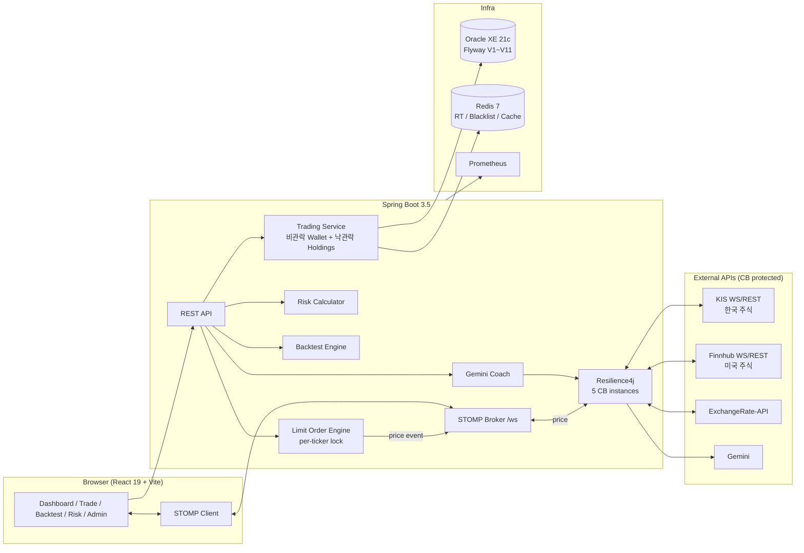
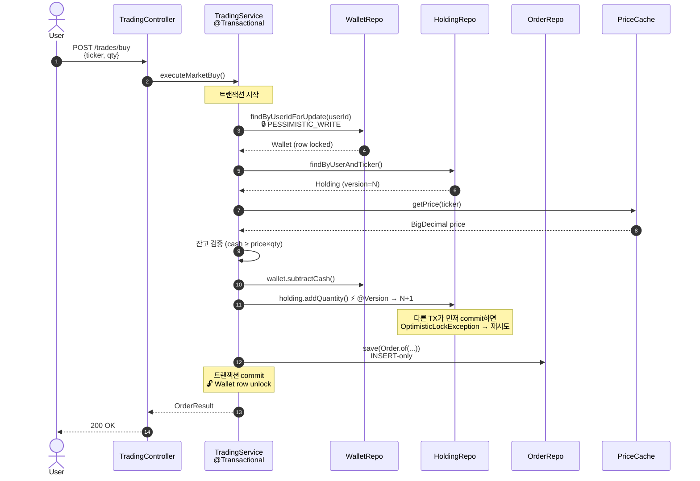
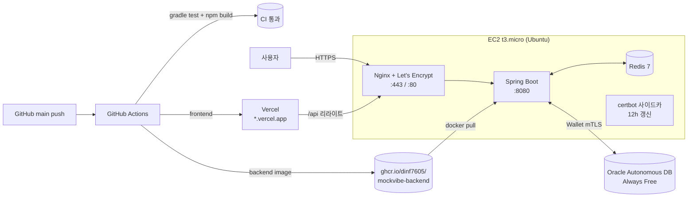
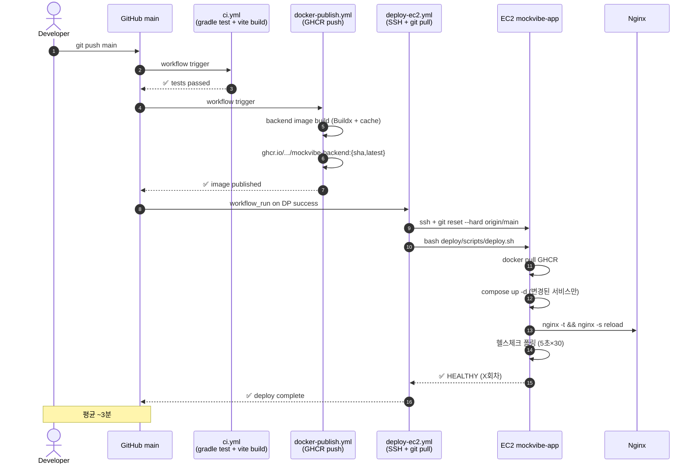
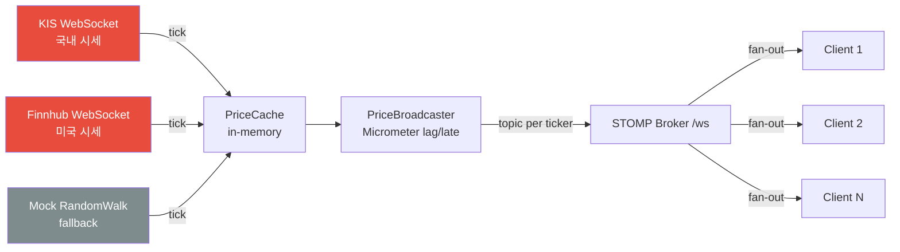

# MockVibe — fintech-simulator

> **한국·미국 주식 통합 실시간 모의투자 + AI 매매 코치 + 백테스트 + 리스크 대시보드 풀스택 플랫폼**

[](https://openjdk.org/projects/jdk/17/)
[](https://spring.io/projects/spring-boot)
[](https://react.dev/)
[](https://www.typescriptlang.org/)
[](https://www.oracle.com/database/technologies/appdev/xe.html)
[](https://github.com/dinf7605/mockvibe/actions/workflows/ci.yml)
[](https://github.com/dinf7605/mockvibe/actions/workflows/docker-publish.yml)
[](https://github.com/dinf7605/mockvibe/actions/workflows/deploy-ec2.yml)
[]()
[]()

🌐 **Live**:
[App ▸ mockvibe-hazel.vercel.app](https://mockvibe-hazel.vercel.app) &nbsp;|&nbsp;
[API ▸ mockvibe.duckdns.org](https://mockvibe.duckdns.org/actuator/health) &nbsp;|&nbsp;
[Swagger UI](https://mockvibe.duckdns.org/swagger-ui/index.html) &nbsp;|&nbsp;
[📖 문서 사이트](https://dinf7605.github.io/mockvibe/)

<!-- TODO(D50): docs/assets/demo.gif 추가 후 아래 한 줄 주석 해제 -->
<!--  -->
<!-- 데모 녹화 가이드: docs/operations/d50-demo-script.md -->


---

## 🎯 한눈에 보기

KRX(한국투자증권 API)와 NYSE/NASDAQ(Finnhub)을 **단일 UI에서 통합 거래**합니다.
외부 WebSocket → 백엔드 캐시 → STOMP 릴레이로 다중 클라이언트에 동시 공급하며, 외부 API가 죽어도 **Mock Fallback + Circuit Breaker**로 데모가 멈추지 않습니다.

### 차별화 4종 세트
| | 설명 |
|---|---|
| 🤖 **AI 매매 코치** | 매매 직후 자동 코멘트 + 주간 회고 (Gemini, Claude API 추상화 호환) |
| 📈 **백테스트 엔진** | 1년치 OHLC로 BuyAndHold / MA20 / RSI14 전략 비교, 자산곡선 + 매매 마커 |
| 📊 **리스크 대시보드** | VaR(Historical) / Sharpe(연율) / Beta / MDD / 집중도 경고 |
| ⚡ **이벤트 기반 지정가 체결** | 폴링 없이 가격 이벤트로 per-ticker 락 + 트랜잭션 체결 |

### 검증된 성능 (k6 부하 테스트, 50 VU · 재측정 2026-05-31)
| 지표 | 결과 | NFR 대비 |
|---|---|---|
| **buy p95** | **15.32ms** | 800ms 목표 대비 **52배 여유** |
| price / portfolio / search p95 | 4.8 / 7.55 / 8.07ms | 전 임계치 통과 |
| 총 호출 | 23,164 (50 VU, 85s) | — |
| 실패율 | **0.00%** | < 2% 목표 충족 |

> 신규 기능(Flyway V1~V11, 워치리스트·가격알림·멱등성 포함) 전체가 올라간 상태에서 재측정.

---

## 🏗️ 아키텍처



---

## 🛠️ 기술 스택

| 영역 | 스택 |
|---|---|
| **Backend** | Spring Boot 3.5.6 · Java 17 · JPA · WebSocket(STOMP) · Spring Security · Resilience4j · Bucket4j · springdoc-openapi |
| **Frontend** | Vite 8 · React 19 · TypeScript 6 · Zustand · @tanstack/react-query · axios · @stomp/stompjs · lightweight-charts · ApexCharts |
| **DB / Cache** | Oracle XE 21c (Docker `gvenzl/oracle-xe:21-slim-faststart`) · Flyway V1~V11 · Redis 7-alpine |
| **External** | KIS 모의투자 · Finnhub · ExchangeRate-API · Gemini (Claude 추상화 호환) |
| **Observability** | Micrometer · Prometheus · **Micrometer Tracing(OpenTelemetry) traceId/spanId** · MDC RequestId · k6 부하 테스트 |
| **Infra** | AWS EC2 t3.micro + Nginx HTTPS · Vercel · Oracle Autonomous DB · GitHub Actions 자동 배포 |

---

## ✨ 주요 기능

### 인증 / 보안
- JWT(HS256) Access 15분 + Refresh 7일, **Refresh Token Rotation + Redis 블랙리스트**
- BCrypt cost 12, httpOnly 쿠키, JwtAccessDeniedHandler
- RBAC `@PreAuthorize` + 깊이 방어 (`/admin` 매트릭스 e2e 검증)
- **StepUp 토큰** (관리자 위험 작업, Redis 5분 1회용)

### 매매 / 동시성

- 시장가 매수/매도 — Wallet **비관적 락** + Holdings **낙관적 락 하이브리드**
- **10병렬 동시 매수 테스트** — 잔고 정합성 검증 통과
- 지정가 주문 — Event-driven, per-ticker `ReentrantLock`, 만료 배치(cron). **풀스택 UI**(시장가/지정가 토글 + 예약 주문 목록·취소)
- **주문 멱등성 키** — `Idempotency-Key` 헤더 → Redis(`idem:{userId}:{key}`, TTL 24h)로 중복 제출(재시도·더블클릭) 1회만 체결
- 거래 내역 + 예약 주문 관리

<details>
<summary>📊 시장가 매수 시퀀스 — 락 획득 순서로 deadlock 불가능 (ADR-004)</summary>



**락 순서는 항상 Wallet → Holdings → Orders** — 모든 매매 경로에서 동일 → 락 그래프에 cycle 없음 → **deadlock 불가능**.
</details>

### 시세 / 환율
- STOMP `/topic/price/{ticker}` 릴레이 + heartbeat
- **PriceBroadcaster Micrometer** lag/count/late SLA(100ms) 측정
- 환율 1분 캐시 + FX_RATES 시계열, KRW 단일 지갑 + USD 환산
- **일봉 실데이터** — 한국 KIS 일봉 + **미국 Yahoo Finance 일봉**(무료, 1년치 backfill + 매일 cron). 장 외 시간엔 최근 종가 폴백으로 매매 가능
- `MarketPollingScheduler` 분당 quote 폴링 → PriceCache + intraday 누적 (KIS WS 불안정 보완)

### 개인화 / 알림 / 랭킹 (D50+)
- ⭐ **관심종목 워치리스트** — 종목 상세 ☆ 토글 + 전용 목록
- 🎯 **가격 알림** — 목표가(이상/이하) 설정 → `PriceUpdatedEvent` 구독 처리기가 도달 시 트리거
- 🔔 **통합 알림 센터** — 가격알림 도달 / 지정가 체결 / AI 코멘트를 한 피드로. **STOMP 사용자별 실시간 푸시**(`/user/queue/notifications`, CONNECT 시 JWT→Principal 인터셉터) + 미확인 배지
- 🏆 **수익률 랭킹 + 자산 추이** — 일별 `PORTFOLIO_SNAPSHOT` 배치(부팅 1회 + 매일) → 리더보드 + 내 자산 추이 area 차트
- 📰 **종목 뉴스** — Finnhub `company-news`(US, 타임아웃·Redis 캐시 15분 보호)
- 매매·관심·알림 동작에 **전역 토스트** 피드백, 반응형 셸(데스크톱 사이드바 / 모바일 하단 탭바)

### AI 코치 (Gemini)
- 매매 직후 `OrderExecutedEvent` → `AiCommentListener` 자동 코멘트
- 주간 회고 스케줄러 (SUN 자정, weeklyModel)
- **`AiDailyLimiter`** (Redis 일일 한도) + **portfolioHash 캐시** (holdings 기반 24h)
- `mainModel` / `weeklyModel` 분리, CB `claude` 인스턴스로 보호

### 운영 / 관리자
- 7개 관리자 화면 — Users(시드머니 step-up) · Stocks · Trades · System(CB 신호등) · Audit(diff 뷰) · Announcements · AI Usage
- `@Auditable` AOP → ADMIN_AUDIT_LOGS (before/after JSON diff)
- RequestId MDC 필터 + **분산 추적(traceId/spanId)** 로그 상관관계 → 요청 흐름 추적
- Prometheus `/actuator/prometheus` 노출

---

## 🚀 빠른 시작

### 사전 요구사항
- JDK 17, Node 20+, Docker Desktop

### 1) 인프라 기동
```bash
cd docker
docker compose up -d   # Oracle XE + Redis
```

### 2) 백엔드
```bash
cd backend
cp .env.example .env   # KIS / FINNHUB / GEMINI 키 채우기
./gradlew bootRun      # http://localhost:8080
```
> 외부 API 키가 없어도 **Mock Engine**으로 전 기능 데모 가능 (`@ConditionalOnProperty` 가드).

### 3) 프론트엔드
```bash
cd frontend
npm install
npm run dev            # http://localhost:5173
```

### 4) 부하 테스트
```bash
docker run --rm --network host -v "${PWD}/perf:/perf" \
  -e BASE_URL=http://host.docker.internal:8080 \
  grafana/k6 run /perf/k6-load-test.js
```

### 환경 변수 (`backend/.env`)
```
KIS_APP_KEY=...
KIS_APP_SECRET=...
FINNHUB_API_KEY=...
GEMINI_API_KEY=...
JWT_SECRET=dev-only-secret-change-in-prod
DB_USERNAME=simulator
DB_PASSWORD=simulator
```

---

## 📁 디렉토리 구조

```
mockvibe/
├── backend/                    # Spring Boot 3.5
│   └── src/main/java/com/fintech/simulator/
│       ├── auth/               # JWT + RBAC
│       ├── market/             # Provider 추상화 (kis / finnhub / yahoo / mock)
│       ├── trading/            # 시장가 + 지정가 + 동시성
│       ├── watchlist/          # 관심종목 (V8)
│       ├── alert/              # 가격 알림 (V9)
│       ├── ranking/            # 수익률 랭킹 + 자산 추이 (V10)
│       ├── notification/       # 통합 알림 센터 + STOMP 푸시 (V11)
│       ├── portfolio/          # 보유/대시보드
│       ├── fx/                 # 환율 캐시
│       ├── backtest/           # 전략 엔진 + 시뮬레이션
│       ├── risk/               # VaR / Sharpe / Beta / MDD
│       ├── ai/                 # Gemini 코치 + Redis Limiter
│       ├── admin/              # 7 컨트롤러 + 감사 AOP
│       ├── config/             # Security / CB / Bucket4j
│       └── common/             # ErrorCode / RequestId / Idempotency
├── frontend/                   # Vite + React 19 + TS (반응형 셸 + 코드 스플리팅)
│   └── src/pages/              # 16 page + admin/7 (반응형 셸 + 코드 스플리팅)
├── docker/                     # Oracle XE + Redis compose
├── perf/                       # k6 시나리오
├── docs/decisions/             # ADR (9건. 추가 예정)
├── docs/operations/            # D49 postmortem + D50 데모 스크립트
├── PRD.md                      # 요구사항 v2.0
└── DAILY_PLAN.md               # 50일 작업 계획
```

---

## 🗃️ 데이터 모델 (Flyway 점진 마이그레이션)

| 버전 | Phase | 추가 테이블 |
|---|---|---|
| **V1** | P1 D03 | USERS · WALLET · STOCKS · HOLDINGS · ORDERS · FX_RATES |
| **V2** | P1 D08 | STOCKS 60종 시드 (한 30 + 미 30) |
| **V3** | P3 D21 | LIMIT_ORDERS |
| **V4** | P4 D26 | PRICE_HISTORY (1년치 랜덤워크 시드) |
| **V5** | P5 D31 | BACKTEST_RUNS |
| **V6** | P6 D36 | AI_REPORTS |
| **V7** | P7 D41 | ADMIN_AUDIT_LOGS · ANNOUNCEMENTS |
| **V8** | D50+ | WATCHLIST (관심종목) |
| **V9** | D50+ | PRICE_ALERT (가격 알림) |
| **V10** | D50+ | PORTFOLIO_SNAPSHOT (수익률 랭킹·자산 추이) |
| **V11** | D50+ | NOTIFICATION (통합 알림 센터) |

> **왜 점진 마이그레이션?** [ADR-001](docs/decisions/ADR-001-data-model.md) 참조 — 운영의 사실성 + 롤백 단위 격리.

---

## 🔌 외부 API 통합 & 회복탄력성

| Provider | 사용 | Circuit Breaker | 가드 |
|---|---|---|---|
| KIS WS/REST | 한국 주식 OAuth + approval_key + 실시간 시세 | `kis-auth`, `kis-approval`, `kis-rest` | `@ConditionalOnProperty(kis.enabled)` |
| Finnhub WS | 미국 주식 실시간 시세 (5종목 무료 티어) | (재시도 정책) | `@ConditionalOnProperty(finnhub.enabled)` |
| ExchangeRate-API | KRW/USD 환율, 1분 캐시 | `fx-rate` | — |
| Yahoo Finance | 미국 종목 일봉 1년치 (무료·키 불필요, Stooq 대체) | — | — |
| Gemini | AI 코멘트/회고, mainModel + weeklyModel 분리 | `claude` (이름 유지) | Redis 일일 한도 · `@ConditionalOnProperty(gemini.api-key)` |

**CB 정책**: 5개 인스턴스 모두 `failureRate 50% · waitDurationInOpenState 30s`. Open 상태에서는 Mock Engine으로 폴백하여 **데모가 절대 멈추지 않음**.

---

## ✅ 검증

| 항목 | 결과 |
|---|---|
| 단위 테스트 | **80 / 80 통과** |
| ErrorCode 사용 | **28 / 28** 전체 활용 |
| e2e 시나리오 | 22 케이스 (전 도메인) 정상 |
| 외부 API 실연동 | KIS OAuth+approval_key+WS · Finnhub WS · Gemini · ExchangeRate-API 4종 모두 확인 |
| 동시성 | 10병렬 매수 잔고 정합성 통과 |
| 부하 | 50 VU · 23,164 호출 · 실패 **0.00%** · buy p95 **15.32ms** (재측정 2026-05-31) |

---

## 🗺️ 로드맵

### 완료 (D01~D48)
- ✅ Phase 1 MVP — 골격 + 인증 + 시장가 매매 + 동시성
- ✅ Phase 2 시세 파이프 — STOMP + KIS/Finnhub/FX
- ✅ Phase 3 지정가 + Resilience4j Circuit Breaker
- ✅ Phase 4 리스크 분석 (VaR/Sharpe/Beta/MDD)
- ✅ Phase 5 백테스트 엔진 + 자산곡선
- ✅ Phase 6 AI 코치 (Gemini)
- ✅ Phase 7 관리자 + 운영 + Docker + k6

### 진행 예정
- ✅ **D49 (완료, 2026-05-26)** — 운영 환경 가동 + 자동 배포
  - ✅ AWS EC2 t3.micro (ap-northeast-2) + Elastic IP + DuckDNS
  - ✅ Oracle Autonomous Database (Always Free, ap-chuncheon-1) + Wallet mTLS
  - ✅ Nginx + Let's Encrypt 자동 갱신 + WebSocket/STOMP HTTPS
  - ✅ Vercel 프론트 배포 + CORS 매칭
  - ✅ **`git push` 만으로 자동 배포** (GitHub Actions → SSH → EC2)
  - ✅ 종단 테스트 통과 (회원가입 → 로그인 → 종목 상세 → wss 101)
  - 📄 [11건의 운영 이슈 진단 기록](docs/operations/d49-deployment-postmortem.md)
- ✅ **D50** ADR + 데모 스크립트 + 문서 사이트

### D50 이후 추가 기능
- ✅ 미국 일봉 실데이터 (Yahoo Finance) + `STOCKS.current_price` 동기화
- ✅ 관심종목 워치리스트 (V8)
- ✅ 가격 알림 — 목표가 도달 트리거 (V9)
- ✅ 주문 멱등성 키 (Idempotency-Key + Redis)
- ✅ 지정가 주문 풀스택 UI (시장가/지정가 토글 + 예약 주문 관리)
- ✅ **유저 친화적 리디자인** — 반응형 앱 셸(데스크톱 사이드바 / 모바일 하단 탭바), 전역 토스트, 빈 상태, 라우트 코드 스플리팅(초기 번들 1.19MB→374KB)
- ✅ 대시보드 AI 카드 실연동 (`/ai/reports` + 즉시 분석)
- ✅ **수익률 랭킹 + 자산 추이** (V10 PORTFOLIO_SNAPSHOT 일별 배치)
- ✅ **통합 알림 센터 + STOMP 사용자별 실시간 푸시** (V11 NOTIFICATION)
- ✅ **종목 뉴스** (Finnhub company-news, 타임아웃·캐시)
- ✅ **OpenTelemetry 분산 추적** (Micrometer Tracing, traceId/spanId 로그 상관관계)
- ✅ KIS access token·approval_key **Redis 영속화** (1일 1회 발급 원칙)
- ✅ Flyway **repair()→migrate() 전략** (실패 마이그레이션 자가복구)

### 향후 후보
- 💡 OTLP exporter → Jaeger/Tempo 추적 백엔드 연동
- 💡 Web Push 알림 (브라우저 푸시) · 분봉 차트
- 💡 이벤트 스트리밍(Redis Streams) 전환

---

## 🌐 운영 배포

자세한 결정 배경은 [ADR-002: 배포 토폴로지](docs/decisions/ADR-002-deployment-topology.md) 참조.



### EC2 첫 배포 (한 번만)
```bash
# 1) EC2 부팅 후 SSH 접속, bootstrap 실행 (Docker / swap / clone)
scp -i key.pem deploy/scripts/bootstrap-ec2.sh ubuntu@<EC2_IP>:~
ssh -i key.pem ubuntu@<EC2_IP> 'bash ~/bootstrap-ec2.sh'

# 2) .env.prod 채우기 + Oracle Wallet 압축 해제 → deploy/oracle-wallet/

# 3) Let's Encrypt 인증서 발급 (DuckDNS 등 도메인 사전 등록 필요)
ssh ... 'cd mockvibe && bash deploy/scripts/issue-cert.sh'

# 4) 본 배포
ssh ... 'cd mockvibe && bash deploy/scripts/deploy.sh'
```

### 자동 배포 흐름 — `git push` 한 줄



문제 시: `bash deploy/scripts/rollback.sh <previous_sha>` (EC2 SSH).

### 프론트엔드 (Vercel)
- GitHub 저장소 연결 → `frontend/` 디렉토리 자동 감지
- 환경변수: `VITE_API_BASE_URL=https://mockvibe.duckdns.org` (WebSocket URL은 코드에서 자동 파생)
- `vercel.json` SPA fallback (axios가 baseURL 직접 호출)

### 시세 흐름 — 외부 WebSocket → STOMP → 클라이언트



→ 외부 Provider 하나가 죽어도 (CB Open) Mock 으로 자동 대체. **클라이언트는 어떤 출처인지 모름** — Provider 추상화 ([ADR-006](docs/decisions/ADR-006-provider-abstraction.md)).

### 무료 도메인 (DuckDNS)
1. [duckdns.org](https://www.duckdns.org/) 로그인 → 서브도메인 생성 (예: `mockvibe`)
2. EC2 Elastic IP 등록
3. 발급된 `mockvibe.duckdns.org` 를 `.env.prod`의 `APP_DOMAIN`에 입력

---

## 📚 문서

- 📄 [PRD.md](PRD.md) — 요구사항 v2.0 (관리자 페이지 포함)
- 📅 [DAILY_PLAN.md](DAILY_PLAN.md) — 10주 50일 작업 계획
- 🏛️ [docs/decisions/](docs/decisions/) — Architecture Decision Records
- 📊 [docs/perf/D48-load-test.md](docs/perf/D48-load-test.md) — 부하 테스트 결과
- 🩺 [docs/operations/d49-deployment-postmortem.md](docs/operations/d49-deployment-postmortem.md) — D49 운영 배포 중 잡은 11건 이슈 (oraclepki · Flyway baseline · Tomcat strict · nginx HTTP/2-WS 충돌 등)
- 🎬 [docs/operations/d50-demo-script.md](docs/operations/d50-demo-script.md) — 45초 데모 영상 스크립트
- 🏛️ [ADR-001 데이터 모델 V1 설계](docs/decisions/ADR-001-data-model.md)
- 🏛️ [ADR-002 배포 토폴로지](docs/decisions/ADR-002-deployment-topology.md)
- 🏛️ [ADR-003 운영 회복력 — D49 11건 → 영구 정책](docs/decisions/ADR-003-operational-resilience.md)
- 🏛️ [ADR-004 동시성 — 비관/낙관 락 하이브리드](docs/decisions/ADR-004-concurrency-locking.md)
- 🏛️ [ADR-005 Circuit Breaker — Resilience4j 5 인스턴스](docs/decisions/ADR-005-circuit-breaker.md)
- 🏛️ [ADR-006 Provider 추상화 — KIS·Finnhub·Mock](docs/decisions/ADR-006-provider-abstraction.md)
- 🏛️ [ADR-007 WebSocket 재연결 — Exponential Backoff + CB 협력](docs/decisions/ADR-007-websocket-reconnect.md)
- 🏛️ [ADR-008 SSH 접근 정책 — 0.0.0.0/0 + 키 인증, 향후 SSM 전환](docs/decisions/ADR-008-ssh-access-policy.md)
- 🏛️ [ADR-009 관측성 — Micrometer + Prometheus + 자체 도메인 지표](docs/decisions/ADR-009-observability.md)

---

## 📜 라이선스

MIT. 본 프로젝트는 **모의투자 전용**이며 실거래 기능을 제공하지 않습니다.
KIS / Finnhub / Gemini / ExchangeRate-API 사용은 각 제공자 약관에 따릅니다.
