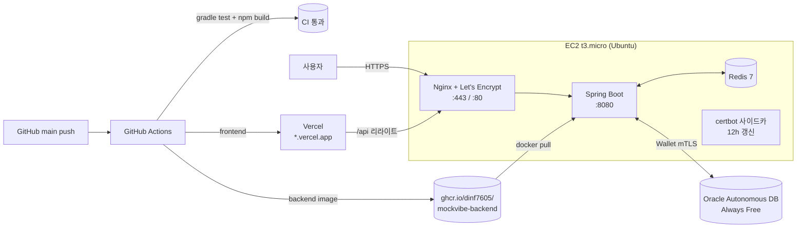

# MockVibe — fintech-simulator

> **한국·미국 주식 통합 실시간 모의투자 + AI 매매 코치 + 백테스트 + 리스크 대시보드 풀스택 플랫폼**

[](https://openjdk.org/projects/jdk/17/)
[](https://spring.io/projects/spring-boot)
[](https://react.dev/)
[](https://www.typescriptlang.org/)
[](https://www.oracle.com/database/technologies/appdev/xe.html)
[](https://github.com/dinf7605/mockvibe/actions/workflows/ci.yml)
[](https://github.com/dinf7605/mockvibe/actions/workflows/docker-publish.yml)
[](https://github.com/dinf7605/mockvibe/actions/workflows/deploy-ec2.yml)
[]()
[]()

🌐 **Live**:
[App ▸ mockvibe-hazel.vercel.app](https://mockvibe-hazel.vercel.app) &nbsp;|&nbsp;
[API ▸ mockvibe.duckdns.org](https://mockvibe.duckdns.org/actuator/health) &nbsp;|&nbsp;
[Swagger UI](https://mockvibe.duckdns.org/swagger-ui/index.html)

---

## 🎯 한눈에 보기

KRX(한국투자증권 API)와 NYSE/NASDAQ(Finnhub)을 **단일 UI에서 통합 거래**합니다.
외부 WebSocket → 백엔드 캐시 → STOMP 릴레이로 다중 클라이언트에 동시 공급하며, 외부 API가 죽어도 **Mock Fallback + Circuit Breaker**로 데모가 멈추지 않습니다.

### 차별화 4종 세트
| | 설명 |
|---|---|
| 🤖 **AI 매매 코치** | 매매 직후 자동 코멘트 + 주간 회고 (Gemini, Claude API 추상화 호환) |
| 📈 **백테스트 엔진** | 1년치 OHLC로 BuyAndHold / MA20 / RSI14 전략 비교, 자산곡선 + 매매 마커 |
| 📊 **리스크 대시보드** | VaR(Historical) / Sharpe(연율) / Beta / MDD / 집중도 경고 |
| ⚡ **이벤트 기반 지정가 체결** | 폴링 없이 가격 이벤트로 per-ticker 락 + 트랜잭션 체결 |

### 검증된 성능 (D48 부하 테스트)
| 지표 | 결과 | NFR 대비 |
|---|---|---|
| **buy p95** | **32.72ms** | 800ms 목표 대비 **24배 여유** |
| 총 호출 | 21,361 (50 VU, 5분) | — |
| 실패율 | **0.02%** | < 1% 목표 충족 |

---

## 🏗️ 아키텍처


---

## 🛠️ 기술 스택

| 영역 | 스택 |
|---|---|
| **Backend** | Spring Boot 3.5.6 · Java 17 · JPA · WebSocket(STOMP) · Spring Security · Resilience4j · Bucket4j · springdoc-openapi |
| **Frontend** | Vite 8 · React 19 · TypeScript 6 · Zustand · @tanstack/react-query · axios · @stomp/stompjs · lightweight-charts · ApexCharts |
| **DB / Cache** | Oracle XE 21c (Docker `gvenzl/oracle-xe:21-slim-faststart`) · Flyway V1~V7 · Redis 7-alpine |
| **External** | KIS 모의투자 · Finnhub · ExchangeRate-API · Gemini (Claude 추상화 호환) |
| **Observability** | Micrometer · Prometheus · MDC RequestId · k6 부하 테스트 |
| **Infra (예정)** | AWS EC2 t3.micro + Nginx HTTPS · Vercel · Oracle Autonomous DB |

---

## ✨ 주요 기능

### 인증 / 보안
- JWT(HS256) Access 15분 + Refresh 7일, **Refresh Token Rotation + Redis 블랙리스트**
- BCrypt cost 12, httpOnly 쿠키, JwtAccessDeniedHandler
- RBAC `@PreAuthorize` + 깊이 방어 (`/admin` 매트릭스 e2e 검증)
- **StepUp 토큰** (관리자 위험 작업, Redis 5분 1회용)

### 매매 / 동시성
- 시장가 매수/매도 — Wallet **비관적 락** + Holdings **낙관적 락 하이브리드**
- **10병렬 동시 매수 테스트** — 잔고 정합성 검증 통과
- 지정가 주문 — Event-driven, per-ticker `ReentrantLock`, 만료 배치(cron)
- 거래 내역 + 예약 주문 관리

### 시세 / 환율
- STOMP `/topic/price/{ticker}` 릴레이 + heartbeat
- **PriceBroadcaster Micrometer** lag/count/late SLA(100ms) 측정
- 환율 1분 캐시 + FX_RATES 시계열, KRW 단일 지갑 + USD 환산

### AI 코치 (Gemini)
- 매매 직후 `OrderExecutedEvent` → `AiCommentListener` 자동 코멘트
- 주간 회고 스케줄러 (SUN 자정, weeklyModel)
- **`AiDailyLimiter`** (Redis 일일 한도) + **portfolioHash 캐시** (holdings 기반 24h)
- `mainModel` / `weeklyModel` 분리, CB `claude` 인스턴스로 보호

### 운영 / 관리자
- 7개 관리자 화면 — Users(시드머니 step-up) · Stocks · Trades · System(CB 신호등) · Audit(diff 뷰) · Announcements · AI Usage
- `@Auditable` AOP → ADMIN_AUDIT_LOGS (before/after JSON diff)
- RequestId MDC 필터 → 로그 추적
- Prometheus `/actuator/prometheus` 노출

---

## 🚀 빠른 시작

### 사전 요구사항
- JDK 17, Node 20+, Docker Desktop

### 1) 인프라 기동
```bash
cd docker
docker compose up -d   # Oracle XE + Redis
```

### 2) 백엔드
```bash
cd backend
cp .env.example .env   # KIS / FINNHUB / GEMINI 키 채우기
./gradlew bootRun      # http://localhost:8080
```
> 외부 API 키가 없어도 **Mock Engine**으로 전 기능 데모 가능 (`@ConditionalOnProperty` 가드).

### 3) 프론트엔드
```bash
cd frontend
npm install
npm run dev            # http://localhost:5173
```

### 4) 부하 테스트
```bash
docker run --rm --network host -v "${PWD}/perf:/perf" \
  -e BASE_URL=http://host.docker.internal:8080 \
  grafana/k6 run /perf/k6-load-test.js
```

### 환경 변수 (`backend/.env`)
```
KIS_APP_KEY=...
KIS_APP_SECRET=...
FINNHUB_API_KEY=...
GEMINI_API_KEY=...
JWT_SECRET=dev-only-secret-change-in-prod
DB_USERNAME=simulator
DB_PASSWORD=simulator
```

---

## 📁 디렉토리 구조

```
mockvibe/
├── backend/                    # Spring Boot 3.5
│   └── src/main/java/com/fintech/simulator/
│       ├── auth/               # JWT + RBAC
│       ├── market/             # Provider 추상화 (kis / finnhub / mock)
│       ├── trading/            # 시장가 + 지정가 + 동시성
│       ├── portfolio/          # 보유/대시보드
│       ├── fx/                 # 환율 캐시
│       ├── backtest/           # 전략 엔진 + 시뮬레이션
│       ├── risk/               # VaR / Sharpe / Beta / MDD
│       ├── ai/                 # Gemini 코치 + Redis Limiter
│       ├── admin/              # 7 컨트롤러 + 감사 AOP
│       ├── config/             # Security / CB / Bucket4j
│       └── common/             # ErrorCode 28종 / RequestId
├── frontend/                   # Vite + React 19 + TS
│   └── src/pages/              # 12 page + admin/7
├── docker/                     # Oracle XE + Redis compose
├── perf/                       # k6 시나리오
├── docs/decisions/             # ADR (현재 ADR-001, 12개 추가 예정)
├── PRD.md                      # 요구사항 v2.0
└── DAILY_PLAN.md               # 50일 작업 계획
```

---

## 🗃️ 데이터 모델 (Flyway 점진 마이그레이션)

| 버전 | Phase | 추가 테이블 |
|---|---|---|
| **V1** | P1 D03 | USERS · WALLET · STOCKS · HOLDINGS · ORDERS · FX_RATES |
| **V2** | P1 D08 | STOCKS 60종 시드 (한 30 + 미 30) |
| **V3** | P3 D21 | LIMIT_ORDERS |
| **V4** | P4 D26 | PRICE_HISTORY (1년치 랜덤워크 시드) |
| **V5** | P5 D31 | BACKTEST_RUNS |
| **V6** | P6 D36 | AI_REPORTS |
| **V7** | P7 D41 | ADMIN_AUDIT_LOGS · ANNOUNCEMENTS |

> **왜 점진 마이그레이션?** [ADR-001](docs/decisions/ADR-001-data-model.md) 참조 — 운영의 사실성 + 롤백 단위 격리.

---

## 🔌 외부 API 통합 & 회복탄력성

| Provider | 사용 | Circuit Breaker | 가드 |
|---|---|---|---|
| KIS WS/REST | 한국 주식 OAuth + approval_key + 실시간 시세 | `kis-auth`, `kis-approval`, `kis-rest` | `@ConditionalOnProperty(kis.enabled)` |
| Finnhub WS | 미국 주식 실시간 시세 (5종목 무료 티어) | (재시도 정책) | `@ConditionalOnProperty(finnhub.enabled)` |
| ExchangeRate-API | KRW/USD 환율, 1분 캐시 | `fx-rate` | — |
| Gemini | AI 코멘트/회고, mainModel + weeklyModel 분리 | `claude` (이름 유지) | Redis 일일 한도 |

**CB 정책**: 5개 인스턴스 모두 `failureRate 50% · waitDurationInOpenState 30s`. Open 상태에서는 Mock Engine으로 폴백하여 **데모가 절대 멈추지 않음**.

---

## ✅ 검증

| 항목 | 결과 |
|---|---|
| 단위 테스트 | **80 / 80 통과** |
| ErrorCode 사용 | **28 / 28** 전체 활용 |
| e2e 시나리오 | 22 케이스 (전 도메인) 정상 |
| 외부 API 실연동 | KIS OAuth+approval_key+WS · Finnhub WS · Gemini · ExchangeRate-API 4종 모두 확인 |
| 동시성 | 10병렬 매수 잔고 정합성 통과 |
| 부하 | 50 VU · 21,361 호출 · 실패 0.02% · buy p95 **32.72ms** |

---

## 🗺️ 로드맵

### 완료 (D01~D48)
- ✅ Phase 1 MVP — 골격 + 인증 + 시장가 매매 + 동시성
- ✅ Phase 2 시세 파이프 — STOMP + KIS/Finnhub/FX
- ✅ Phase 3 지정가 + Resilience4j Circuit Breaker
- ✅ Phase 4 리스크 분석 (VaR/Sharpe/Beta/MDD)
- ✅ Phase 5 백테스트 엔진 + 자산곡선
- ✅ Phase 6 AI 코치 (Gemini)
- ✅ Phase 7 관리자 + 운영 + Docker + k6

### 진행 예정
- ✅ **D49 (완료, 2026-05-26)** — 운영 환경 가동 + 자동 배포
  - ✅ AWS EC2 t3.micro (ap-northeast-2) + Elastic IP + DuckDNS
  - ✅ Oracle Autonomous Database (Always Free, ap-chuncheon-1) + Wallet mTLS
  - ✅ Nginx + Let's Encrypt 자동 갱신 + WebSocket/STOMP HTTPS
  - ✅ Vercel 프론트 배포 + CORS 매칭
  - ✅ **`git push` 만으로 자동 배포** (GitHub Actions → SSH → EC2)
  - ✅ 종단 테스트 통과 (회원가입 → 로그인 → 종목 상세 → wss 101)
  - 📄 [11건의 운영 이슈 진단 기록](docs/operations/d49-deployment-postmortem.md)
- ⏳ **D50** ADR 12개 추가 + 데모 영상
- 💡 OpenTelemetry 분산 추적
- 💡 Web Push 알림 (지정가 체결 / 리스크 임계 돌파)

---

## 🌐 운영 배포

자세한 결정 배경은 [ADR-002: 배포 토폴로지](docs/decisions/ADR-002-deployment-topology.md) 참조.



### EC2 첫 배포 (한 번만)
```bash
# 1) EC2 부팅 후 SSH 접속, bootstrap 실행 (Docker / swap / clone)
scp -i key.pem deploy/scripts/bootstrap-ec2.sh ubuntu@<EC2_IP>:~
ssh -i key.pem ubuntu@<EC2_IP> 'bash ~/bootstrap-ec2.sh'

# 2) .env.prod 채우기 + Oracle Wallet 압축 해제 → deploy/oracle-wallet/

# 3) Let's Encrypt 인증서 발급 (DuckDNS 등 도메인 사전 등록 필요)
ssh ... 'cd mockvibe && bash deploy/scripts/issue-cert.sh'

# 4) 본 배포
ssh ... 'cd mockvibe && bash deploy/scripts/deploy.sh'
```

### 일상 배포 흐름
1. `main` 브랜치에 푸시 → GitHub Actions가 자동으로
   - `ci.yml`: gradle test + npm build
   - `docker-publish.yml`: `ghcr.io/dinf7605/mockvibe-backend:{sha,latest}` 푸시
2. EC2에서 `bash deploy/scripts/deploy.sh` → 최신 이미지 pull + up -d + 헬스체크 폴링
3. 문제 시 `bash deploy/scripts/rollback.sh <previous_sha>`

### 프론트엔드 (Vercel)
- GitHub 저장소 연결 → `frontend/` 디렉토리 자동 감지
- 환경변수: `VITE_API_BASE_URL=https://<APP_DOMAIN>`, `VITE_WS_URL=wss://<APP_DOMAIN>/ws`
- `vercel.json`이 `/api/*` 요청을 백엔드로 리라이트, SPA fallback 포함

### 무료 도메인 (DuckDNS)
1. [duckdns.org](https://www.duckdns.org/) 로그인 → 서브도메인 생성 (예: `mockvibe`)
2. EC2 Elastic IP 등록
3. 발급된 `mockvibe.duckdns.org` 를 `.env.prod`의 `APP_DOMAIN`에 입력

---

## 📚 문서

- 📄 [PRD.md](PRD.md) — 요구사항 v2.0 (관리자 페이지 포함)
- 📅 [DAILY_PLAN.md](DAILY_PLAN.md) — 10주 50일 작업 계획
- 🏛️ [docs/decisions/](docs/decisions/) — Architecture Decision Records
- 📊 [docs/perf/D48-load-test.md](docs/perf/D48-load-test.md) — 부하 테스트 결과
- 🩺 [docs/operations/d49-deployment-postmortem.md](docs/operations/d49-deployment-postmortem.md) — D49 운영 배포 중 잡은 11건 이슈 (oraclepki · Flyway baseline · Tomcat strict · nginx HTTP/2-WS 충돌 등)
- 🎬 [docs/operations/d50-demo-script.md](docs/operations/d50-demo-script.md) — 45초 데모 영상 스크립트
- 🏛️ [ADR-001 데이터 모델 V1 설계](docs/decisions/ADR-001-data-model.md)
- 🏛️ [ADR-002 배포 토폴로지](docs/decisions/ADR-002-deployment-topology.md)
- 🏛️ [ADR-003 운영 회복력 — D49 11건 → 영구 정책](docs/decisions/ADR-003-operational-resilience.md)
- 🏛️ [ADR-004 동시성 — 비관/낙관 락 하이브리드](docs/decisions/ADR-004-concurrency-locking.md)
- 🏛️ [ADR-005 Circuit Breaker — Resilience4j 5 인스턴스](docs/decisions/ADR-005-circuit-breaker.md)
- 🏛️ [ADR-006 Provider 추상화 — KIS·Finnhub·Mock](docs/decisions/ADR-006-provider-abstraction.md)
- 🏛️ [ADR-007 WebSocket 재연결 — Exponential Backoff + CB 협력](docs/decisions/ADR-007-websocket-reconnect.md)
- 🏛️ [ADR-008 SSH 접근 정책 — 0.0.0.0/0 + 키 인증, 향후 SSM 전환](docs/decisions/ADR-008-ssh-access-policy.md)
- 🏛️ [ADR-009 관측성 — Micrometer + Prometheus + 자체 도메인 지표](docs/decisions/ADR-009-observability.md)

---

## 📜 라이선스

MIT. 본 프로젝트는 **모의투자 전용**이며 실거래 기능을 제공하지 않습니다.
KIS / Finnhub / Gemini / ExchangeRate-API 사용은 각 제공자 약관에 따릅니다.
