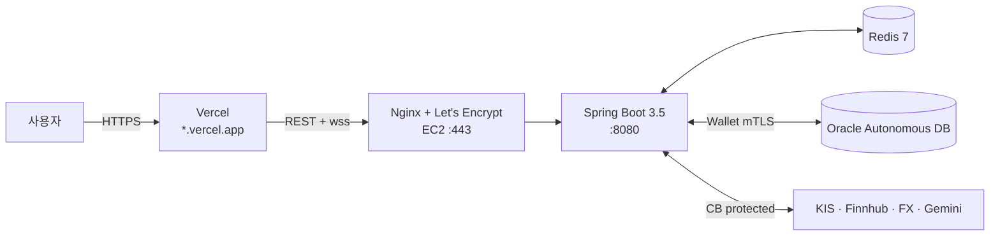

# MockVibe — fintech-simulator

> **한국·미국 주식 통합 실시간 모의투자 + AI 매매 코치 + 백테스트 + 리스크 대시보드 풀스택 플랫폼**

-   :material-rocket-launch: **Live**

    ---

    [App](https://mockvibe-hazel.vercel.app) · [API health](https://mockvibe.duckdns.org/actuator/health) · [Swagger UI](https://mockvibe.duckdns.org/swagger-ui/index.html)

-   :material-source-branch: **GitHub**

    ---

    [github.com/dinf7605/mockvibe](https://github.com/dinf7605/mockvibe)

-   :material-medal-outline: **검증된 성능**

    ---

    k6 50 VU · 21,361 호출 · 실패 0.02% · buy p95 **32.72ms** (NFR 24배 여유)

-   :material-clipboard-pulse-outline: **운영 가동 중**

    ---

    AWS EC2 + Oracle ADB + Vercel + GitHub Actions 자동 배포

---

## 🎯 한눈에 보기

KRX (한국투자증권 API) + NYSE/NASDAQ (Finnhub) 을 **단일 UI에서 통합 거래**. 외부 WebSocket → 백엔드 캐시 → STOMP 릴레이로 다중 클라이언트 동시 공급. 외부 API가 죽어도 **Mock + Circuit Breaker**로 데모가 멈추지 않는다.

### 차별화 4종 세트

| | 설명 |
|---|---|
| 🤖 **AI 매매 코치** | 매매 직후 자동 코멘트 + 주간 회고 (Gemini, Claude API 추상화 호환) |
| 📈 **백테스트 엔진** | 1년치 OHLC로 BuyAndHold / MA20 / RSI14 비교, 자산곡선 + 마커 |
| 📊 **리스크 대시보드** | VaR(Historical) · Sharpe(연율) · Beta · MDD · 집중도 경고 |
| ⚡ **이벤트 기반 지정가** | 폴링 없는 효율적 체결. per-ticker 락 + 단일 트랜잭션 정합성 |

---

## 📚 본 사이트의 문서

!!! info "체계적인 풀스택 프로젝트 기록"
    좌측 사이드바 또는 상단 탭에서 영역별 탐색하세요.

### [의사결정 (ADR) — 9건](decisions/index.md)
운영 환경 구축·동시성·외부 API·보안·관측성 등 9개 핵심 아키텍처 결정을 *왜 그렇게 선택했나* 형식으로 기록.

### [운영](operations/d49-deployment-postmortem.md)
- **[D49 Postmortem](operations/d49-deployment-postmortem.md)** — 운영 배포 중 잡은 **11건의 이슈** 진단·해결·교훈 (oraclepki / Flyway baseline / Tomcat strict / nginx HTTP/2-WS 충돌 등)
- **[D50 데모 영상 스크립트](operations/d50-demo-script.md)** — 45초 컷 7장면 + 녹화/GIF 최적화 가이드

### [성능](perf/D48-load-test.md)
k6 50 VU 5분 부하 테스트 결과. buy API p95 32.72ms.

---

## 🛠 기술 스택

| 영역 | 스택 |
|---|---|
| Backend | Spring Boot 3.5 · Java 17 · JPA · WebSocket(STOMP) · Resilience4j · Bucket4j · springdoc |
| Frontend | Vite 8 · React 19 · TypeScript · Zustand · @tanstack/react-query · lightweight-charts · ApexCharts |
| DB / Cache | Oracle Autonomous DB (Always Free) · Flyway V1~V7 · Redis 7 |
| External | KIS 모의투자 · Finnhub · ExchangeRate-API · Gemini |
| Infra | AWS EC2 t3.micro · Nginx + Let's Encrypt · Vercel · GitHub Actions 자동 배포 |
| Observability | Micrometer · Prometheus · MDC RequestId · k6 |

---

## 🏗️ 아키텍처

자세한 다이어그램은 [GitHub README](https://github.com/dinf7605/mockvibe#-아키텍처) 참조.

---

## 🚀 면접·리뷰어용 5분 코스

이 사이트가 처음이라면:

1. **[D49 Postmortem](operations/d49-deployment-postmortem.md)** — 운영의 현실. 로컬 통과 ≠ 운영 통과 11가지 사례 (5분 훑기)
2. **[ADR-003 운영 회복력](decisions/ADR-003-operational-resilience.md)** — 11건의 fix를 어떻게 영구 정책으로 박았나
3. **[ADR-004 동시성](decisions/ADR-004-concurrency-locking.md)** — 비관/낙관 락 하이브리드 + deadlock 회피
4. **[ADR-005 Circuit Breaker](decisions/ADR-005-circuit-breaker.md)** — 외부 API 5종 격리 + Mock fallback
5. **[Live App](https://mockvibe-hazel.vercel.app)** — 직접 회원가입 → 매수 → 백테스트 (시드머니 1,000만원)

---

!!! tip "본 사이트는 mkdocs-material 로 빌드. main 푸시 시 자동 배포."
    소스: [github.com/dinf7605/mockvibe](https://github.com/dinf7605/mockvibe) · 라이선스: MIT
